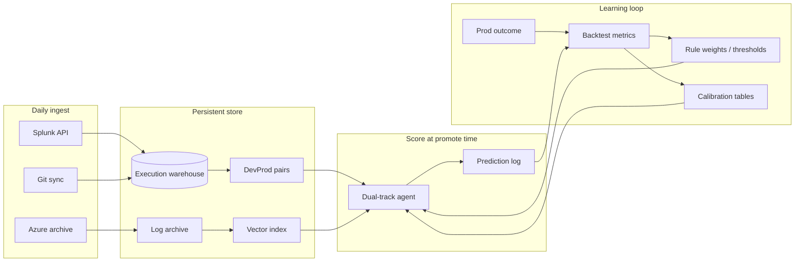

# Enterprise Roadmap — Learning Over Time

This agent is designed as a **compound system**: every week of pipeline activity adds data that makes the next prediction more accurate. No single "train once" step — a **flywheel** of ingest → label → score → measure → tune.

---

## The flywheel



---

## What "gets better" automatically vs needs engineering

| Improves with more data (automatic if pipeline runs) | Needs explicit build |
|-----------------------------------------------------|----------------------|
| More dev→prod pairs → stabler `P(prod_fail \| …)` | Scheduled ingest jobs |
| Vector neighbors more relevant | Incremental vector upsert |
| Module/step histograms richer | Outcome feedback UI |
| Backtest precision measurable | Warehouse DB (not flat JSON) |
| Archive covers more failure modes | Multi-program tenancy |
| | Drift alerts, audit, RBAC |

---

## Maturity stages

### Stage 1 — Now (single program, file-based)

- Splunk API + CSV + `data/log_archive/`
- JSON index: `dev_prod_pairs.json`, `transfer_stats.json`
- Dual-track score (structured + vector)
- Manual `index --rebuild`, `backtest`

**Gate to Stage 2:** 50+ labeled dev→prod pairs, archive-azure running weekly.

### Stage 2 — Operational (scheduled, measured)

- **Cron / Airflow / GitHub Actions** daily:
  1. `fetch-splunk`
  2. `archive-azure` (new executions only)
  3. `index --rebuild` (or incremental)
  4. `backtest` → append to `metrics_history.jsonl`
- **Prediction log:** every `score` stores features + both tracks + timestamp
- **Outcome closure:** when prod run finishes, join to prediction → was it right?
- **Dashboard:** trend charts (precision@High, false comfort, pair count)

**Gate to Stage 3:** 200+ labeled pairs, backtest precision@High stable ≥60%.

### Stage 3 — Enterprise data plane

- **SQLite or PostgreSQL** warehouse:
  - `executions`, `log_artifacts`, `commits`, `pairs`, `predictions`, `outcomes`
- **Incremental vector:** append new log chunks only (not full rebuild)
- **Per-program config:** `programs/19905.yaml` (pipeline IDs, rules)
- **Secrets:** Vault / Azure Key Vault — not flat `.env` in prod
- **API layer:** REST `POST /score/{dev_execution_id}` for CM integration

### Stage 4 — Learned layer (when data supports it)

Only after **200+ outcome-labeled predictions**:

- **Calibrated classifier** on structured features (sklearn/XGBoost) — outputs probability with isotonic calibration from backtest
- **Hybrid score:** `0.6 * structured + 0.3 * vector + 0.1 * classifier` (weights from backtest)
- **Human feedback:** release engineer marks "agree / disagree" → `feedback_labels` table
- **Rule weight auto-tune:** grid search on backtest, human approval before deploy

Still **no cloud LLM on code**.

### Stage 5 — Multi-tenant platform

- Many programs (not only 19905)
- Role-based dashboard (read-only vs promote-gate)
- SLA on score latency (<5s)
- Audit export for compliance
- Optional: webhook blocks promote when `risk=High` + `confidence=high`

---

## Core tables (Stage 3 schema sketch)

```sql
executions(execution_id, program_id, pipeline_id, status, failed_step, started_at, ...)
log_artifacts(execution_id, step, path, sha256, archived_at)
commits(sha, execution_id, modules[], flags[])
pairs(dev_execution_id, prod_execution_id, label, confidence)
predictions(id, dev_execution_id, prob_structured, prob_vector, risk, scored_at)
outcomes(prediction_id, prod_execution_id, prod_status, resolved_at)
metrics_daily(date, precision_high, false_comfort, n_pairs)
```

---

## Learning mechanisms (detail)

### 1. Historical transfer stats (Track A)

Every rebuild recalculates:

- `P(prod_fail | dev_pass)`
- `P(prod_fail | dev_pass, module=X)`
- `P(prod_fail | dev_pass, signal=Y)`

**Improves when:** more promotions happen. No ML required.

### 2. Vector memory (Track B)

Archive grows → more log chunks → better semantic neighbors.

**Improves when:** `archive-azure` runs before 15-day purge.

**Enterprise:** incremental embed — only new executions since last run.

### 3. Outcome-labeled predictions

```text
score(dev_exec) at T0  →  prediction_log
prod runs at T1       →  outcome = FAILED | FINISHED
join at T2            →  labeled example for backtest + future classifier
```

**Improves when:** you close the loop on every promote.

### 4. Calibration over time

Store weekly:

- precision@High, recall@High, false comfort rate
- Brier score (predicted prob vs actual)

Tune `rule_weights.yaml` only when backtest improves on **hold-out** last 20% of pairs.

### 5. Human feedback (enterprise trust)

Release engineer UI:

- "Agent said HIGH — we promoted anyway — prod failed" → strengthens pattern
- "Agent said HIGH — prod passed" → false positive → down-weight rule

---

## What NOT to do

| Anti-pattern | Why |
|--------------|-----|
| Delete archives after vector build | Cannot re-embed or debug |
| Retrain neural net on 20 pairs | Overfits, untrustworthy |
| Cloud LLM on git diffs | Security + non-auditable |
| Auto-promote/block without human | Enterprise needs human gate |
| Single JSON file forever | No concurrent access, no history |

---

## 90-day execution plan

| Week | Action |
|------|--------|
| 1–2 | `.env` prod creds; weekly `fetch-splunk` + `archive-azure`; dashboard |
| 3–4 | Prediction log on every score; manual outcome tagging |
| 5–8 | `metrics_history.jsonl`; dashboard trends; tune MIN_PAIR_SAMPLES |
| 9–12 | SQLite warehouse; incremental index; scheduled jobs |
| 13+ | Evaluate classifier if pairs > 200; API for CM gate |

---

## Success metrics (enterprise)

| Metric | Month 1 | Month 6 | Month 12 |
|--------|---------|---------|----------|
| Labeled dev→prod pairs | 20 | 100 | 300+ |
| precision@High | baseline | ≥55% | ≥70% |
| Archive executions | 50 | 300 | 1000+ |
| Score latency | <60s | <10s | <5s |
| Programs supported | 1 | 1 | N |

---

## Bottom line

**The system learns by accumulating structured memory, not by one-shot model training.**

1. **Never lose raw logs** (`data/log_archive/`)
2. **Close the prediction ↔ outcome loop**
3. **Measure weekly** (backtest metrics history)
4. **Upgrade storage** (JSON → DB) when pair count > 100
5. **Add ML classifier** only when labeled outcomes > 200

Current codebase is **Stage 1**. Stage 2–3 are the path to enterprise-grade improvement over time.
